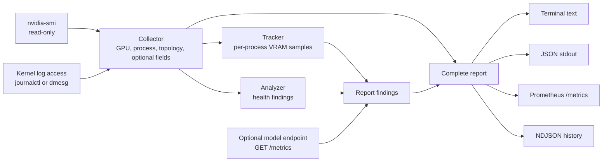
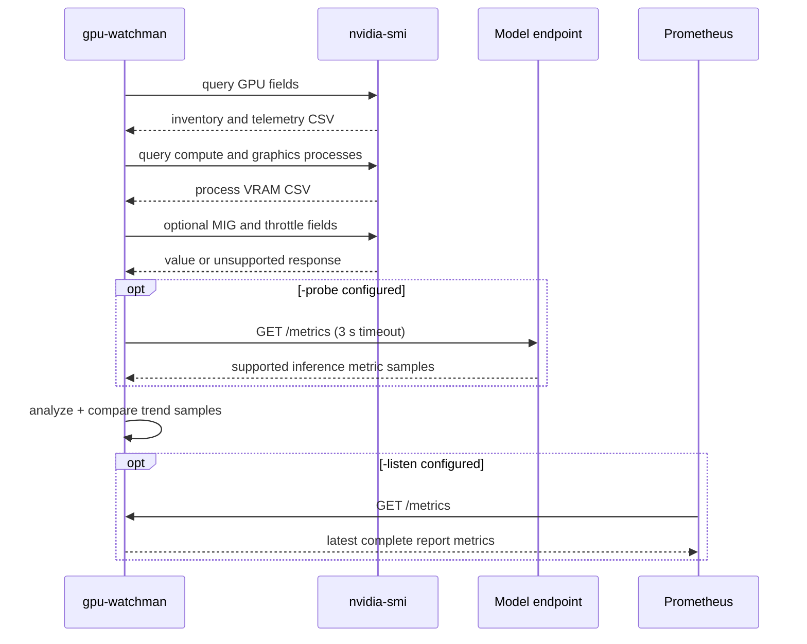

# Architecture

GPU Watchman is organized into three runtime layers: collection, analysis, and presentation. The CLI owns the optional endpoint probe, Prometheus server, in-memory trend tracker, and NDJSON writer.

## One Collection Cycle

## Optional Capability Rules

The base GPU query is required. MIG mode, throttle reasons, topology, Xid events, ECC counters, and retired-page counters depend on the GPU, driver version, host permissions, and NVIDIA feature support. Unsupported optional fields are omitted; they do not prevent the rest of the report from being collected.
