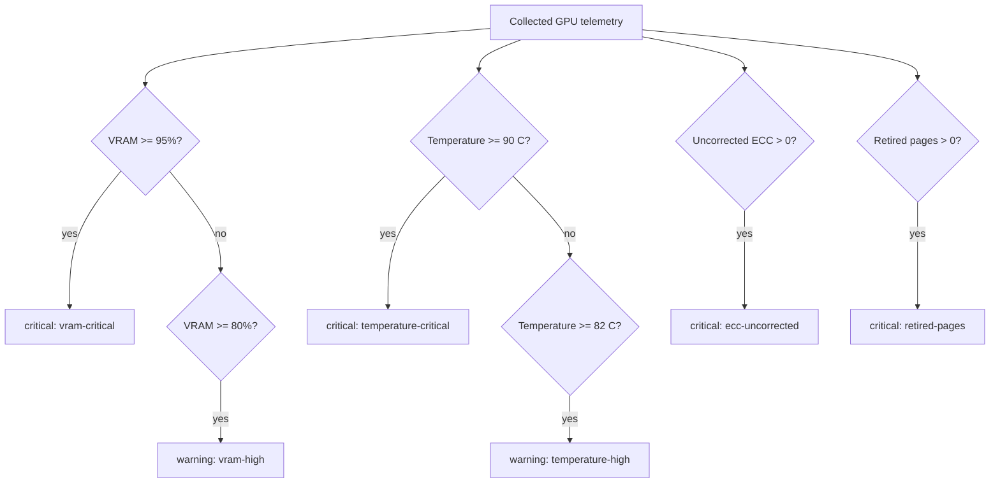

# Hardware Health, Memory Integrity, And Transport

## Analysis Rules



| Signal | Finding | Threshold or condition |
| --- | --- | --- |
| Temperature | `temperature-high` | 82 C or higher |
| Temperature | `temperature-critical` | 90 C or higher |
| Power | `power-limit` | Draw is at least 98% of configured limit |
| PCIe generation | `pcie-generation` | Current generation is below max while GPU use is at least 50% |
| PCIe width | `pcie-width` | Current width is below max |
| ECC corrected | `ecc-corrected` | Counter is above zero |
| ECC uncorrected | `ecc-uncorrected` | Counter is above zero |
| Retired pages | `retired-pages` | Count is above zero |
| Driver throttle | `clock-throttled` | One or more optional throttle reason is active |
| MIG | `mig-enabled` | Driver reports MIG enabled |

## Read The Card

```sh
gpu-watchman -all
```

The text report includes temperature, fan, power draw/limit, P-state, current/max clocks, VRAM, utilization, PCIe link, driver version, ECC mode, process list, findings, and topology when supported.

## Fault Events

Watchman looks for NVIDIA `Xid` entries in accessible kernel logs. If it finds any, it adds one critical `xid-events` finding to the report. Log access may require privileges and is host-specific; use the original kernel log entry for root-cause analysis.
