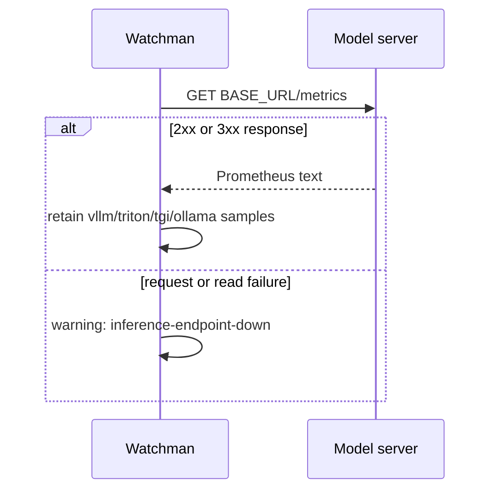
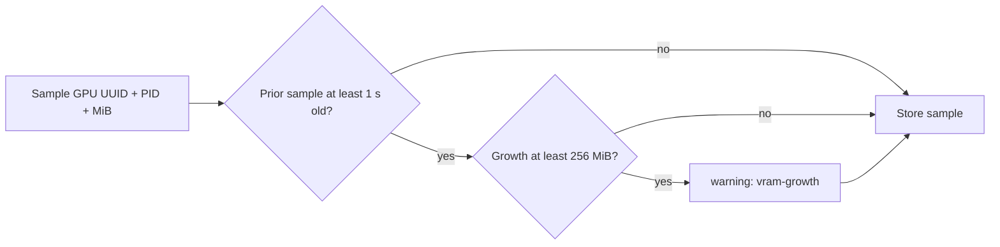

# Inference Probes And VRAM Growth

## Model Endpoint Probe

`-probe` accepts comma-separated base URLs. For every non-empty URL, Watchman appends `/metrics`, makes a GET request with a three-second timeout, and records the endpoint outcome.



```sh
gpu-watchman -watch 5s \
  -probe http://vllm:8000,http://triton:8002
```

Watchman preserves the metric key, including labels, and only retains keys containing `vllm`, `triton`, `tgi`, or `ollama`. A reachable endpoint without one of those keys is reported as `generic`.

## VRAM Growth Detection

The tracker is in memory and exists only for the current process. It is active when repeated collection occurs with `-watch`.



The process key is `<GPU UUID>/<PID>`. If a process disappears from a later sample, its stored baseline is removed. A `vram-growth` finding does not establish the cause of the allocation; it identifies an increase worth investigating.
