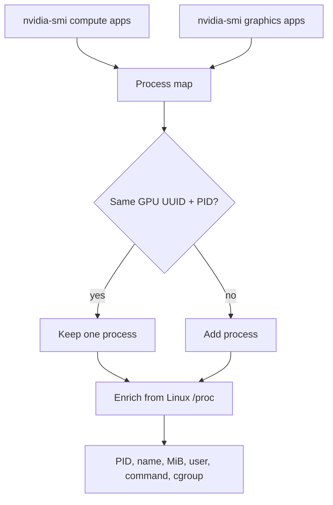

# VRAM Ownership And Process Attribution

GPU Watchman queries both NVIDIA compute and graphics application accounting. Duplicate PID entries are de-duplicated for each GPU UUID.



On Linux, Watchman reads `/proc/<pid>/status`, `/proc/<pid>/cmdline`, and `/proc/<pid>/cgroup` when available. This can identify the host user and often a container or Kubernetes workload. On other hosts, those enrichment fields can be empty.

## Run It

```sh
gpu-watchman -all
```

Use `-all` while investigating an idle or healthy card. Without it, Watchman filters healthy idle GPUs from the text and JSON report after analysis.

## Unattributed VRAM

Watchman emits `unattributed-vram` when more than 256 MiB is in use but NVIDIA reports no compute or graphics process. This is a warning, not proof of a leak: display contexts, permissions, unsupported accounting, or a driver limitation can cause it.

## Related Findings

| Code | Severity | Rule |
| --- | --- | --- |
| `vram-high` | warning | VRAM use is at least 80% |
| `vram-critical` | critical | VRAM use is at least 95% |
| `unattributed-vram` | warning | Used VRAM exceeds 256 MiB with no reported process |
| `vram-reserved` | info | GPU utilization is below 5% and VRAM use is at least 50% |
| `processes` | info | One or more processes are reported |
