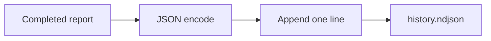

# JSON And NDJSON History

## One JSON Report

Use JSON for scripts, automation, and an incident snapshot:

```sh
gpu-watchman -all -format json > report.json
```

The report contains collection time, GPUs, findings, topology when available, Xid events when accessible, and configured inference endpoint results.

## NDJSON History

Use `-history` with `-watch` to append one full JSON object per collection.

```sh
gpu-watchman -all -watch 10s \
  -history /var/log/gpu-watchman.ndjson
```



The history file is opened with permission mode `0600` when created. Existing file permissions are not changed. Log rotation is the responsibility of the host operator.

## Inspect History

Each line is a standalone JSON document:

```sh
tail -n 1 /var/log/gpu-watchman.ndjson
```

Use `jq` or another JSON parser to query individual report fields. Do not parse the human-readable terminal format for automation.
